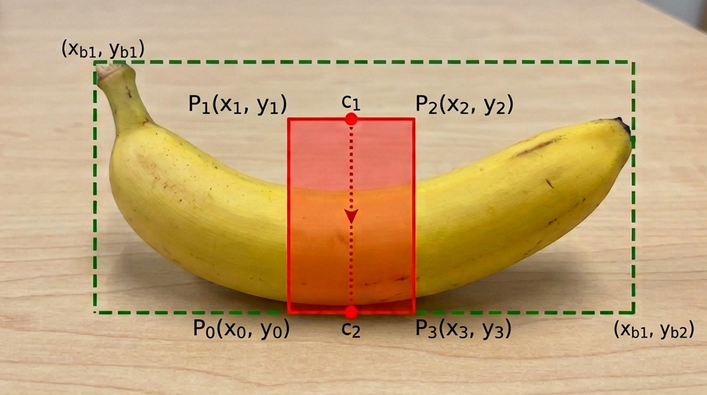
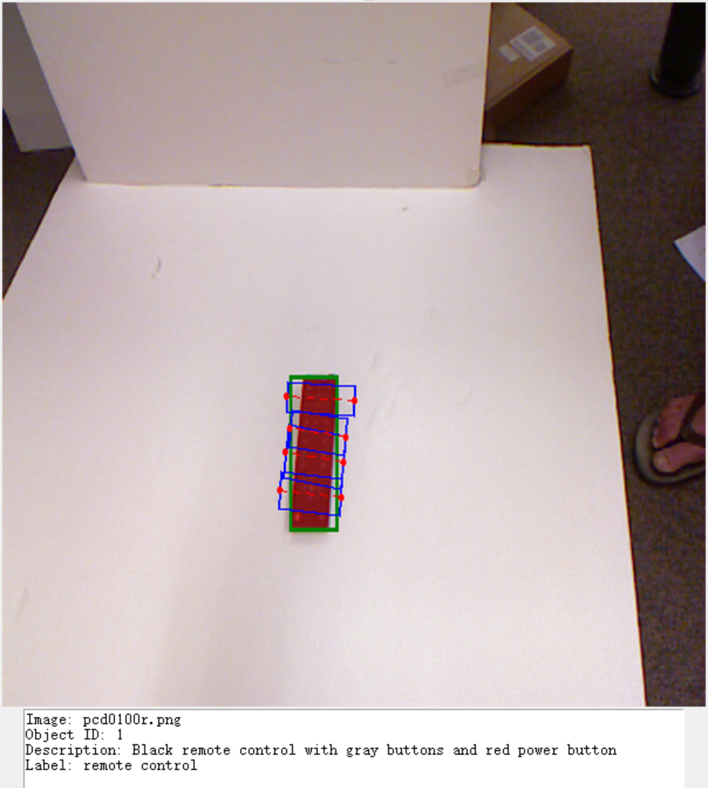
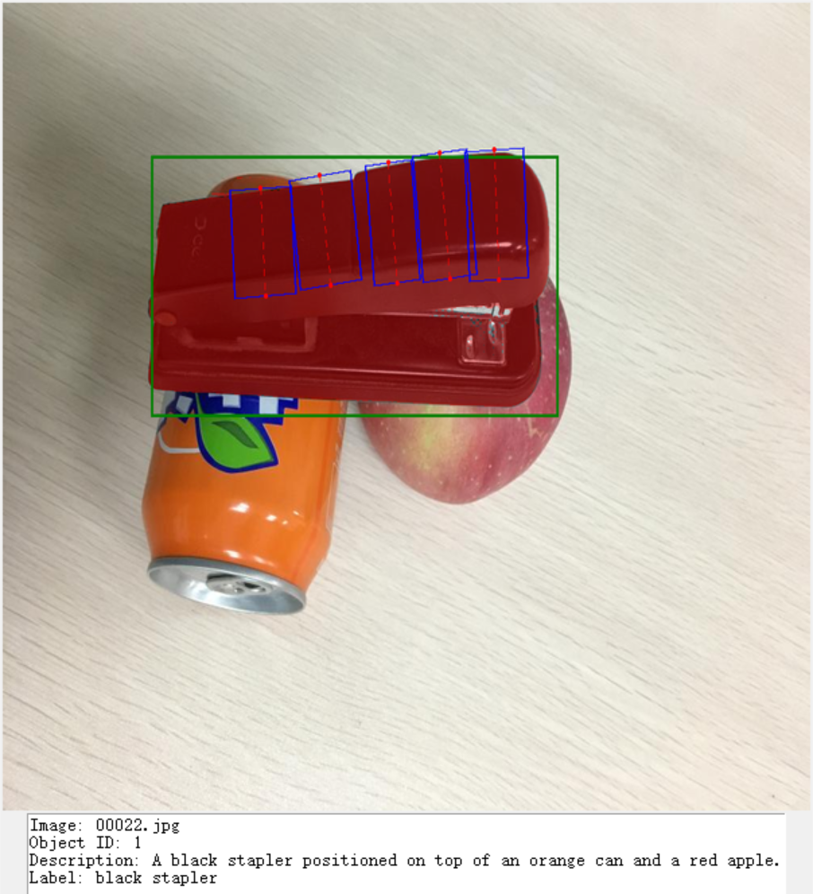
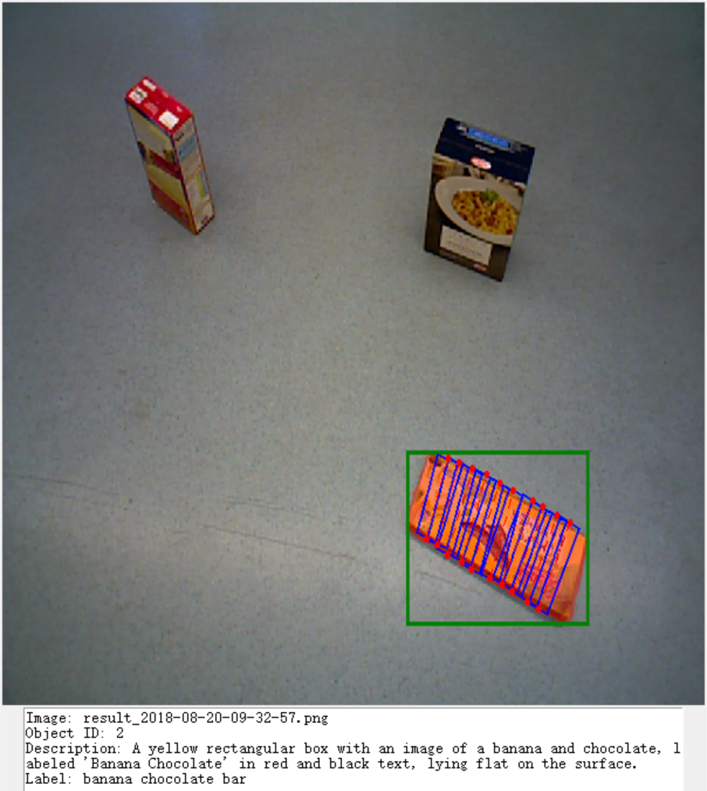
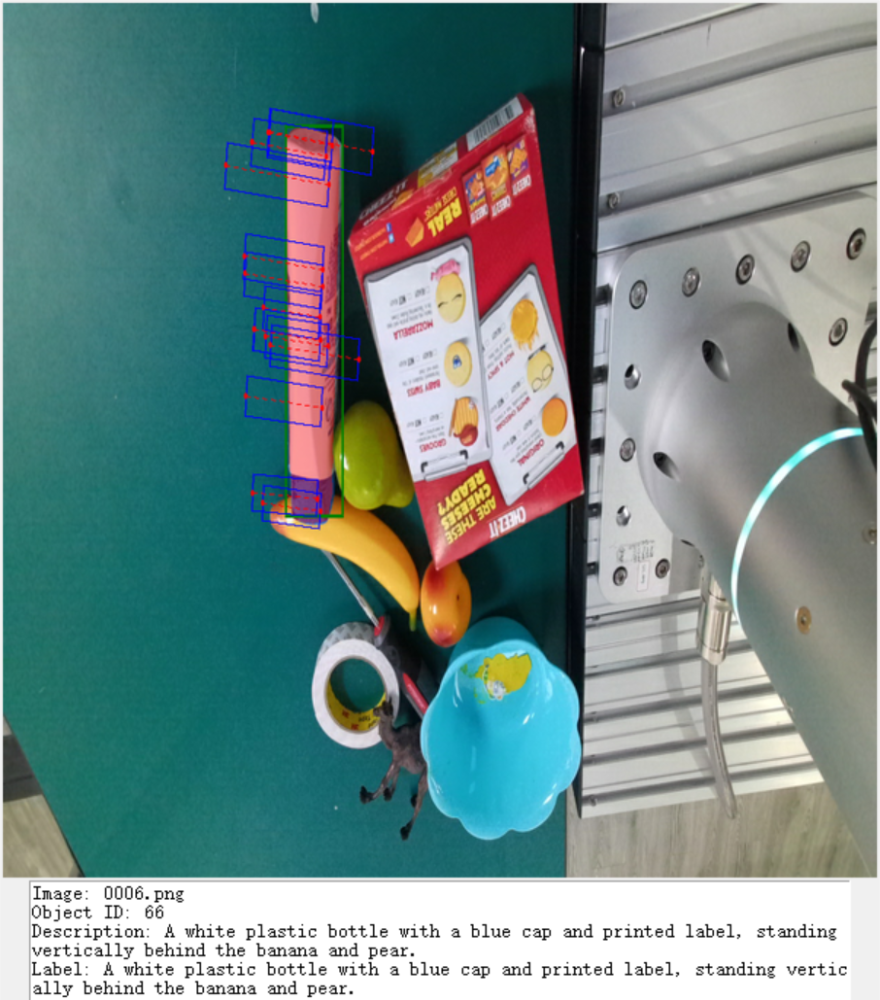
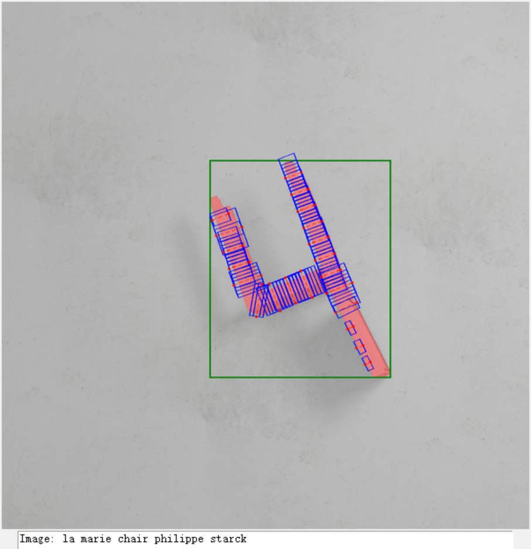

<p align="center">
  <h1 align="center">
    RealVLG-R1: A Large-Scale Real-World Visual-Language Grounding Benchmark for Robotic Perception and Manipulation
    <br>
    [CVPR 2026]
  </h1>
  <p align="center">
  <a href="https://lif314.github.io/"><strong>Linfei Li</strong></a>
  ·
  <a href="https://scholar.google.com/citations?user=8VOk_S4AAAAJ&hl=en"><strong>Lin Zhang*</strong></a>
  ·
  <a href="https://scholar.google.com/citations?user=A0N_mS0AAAAJ&hl=en"><strong>Ying Shen</strong></a>
</p>

  <h3 align="center"><a href="https://lif314.github.io/projects/realvlg_r1/">🌐Project page</a> 
  | <a href="https://cvpr.thecvf.com/virtual/2026/poster/36174">📝Paper(CVF)</a> | <a href="https://arxiv.org/abs/2603.14880">📝Paper(arXiv)</a>
  </h3>
  <div align="center"></div>
</p>

<p align="left">
  <a href="">
    
  </a>
</p>

<!-- TABLE OF CONTENTS -->
<details open="open" style='padding: 10px; border-radius:5px 30px 30px 5px; border-style: solid; border-width: 1px;'>
  <summary>Table of Contents</summary>
  <ol>
    <li>
      <a href="#installation">Installation</a>
    </li>
    <li>
      <a href="#datasets">Datasets</a>
    </li>
    <li>
      <a href="#benchmarking">Benchmarking</a>
    </li>
    <li>
      <a href="#acknowledgement">Acknowledgement</a>
    </li>
    <li>
      <a href="#citation">Citation</a>
    </li>
  </ol>
</details>

## Installation
> **Note**: If you encounter version issues during the installation process, please refer to [EasyR1](https://github.com/hiyouga/EasyR1) and [veRL](https://github.com/verl-project/verl). For tested environments, please refer to [install.sh](./install.sh).

```bash
conda create -n realvlgr1 python==3.10
conda activate realvlgr1

git clone git@github.com:lif314/RealVLG-R1.git
cd RealVLG-R1

pip install -e .
```

## Datasets
You can download the relevant datasets from [ModelScope RealVLG-11B](https://modelscope.cn/datasets/cslinfeili/RealVLG-11B).

Each data sample is annotated as follows:
```json
[
  {
    "image_name": "",
    "image_path": "",
    "object_id": "",
    "mask_path": "",
    "description": "",
    "label": "", # short description
    "bbox": [x1, y1, x2, y2],
    "grasps": [
      [x0,y0,x1,y1,x2,y2,x3,y3],
      ...
    ],
    "contact_points": [
    [x1,y1, x2, y2],
    ...
    ]
  }
]
```

The definition diagrams of bbox and grasp are shown in the figure below:


### Usage

Download the dataset and extract `xxx_VLG.zip`. In each `xxx_VLG` folder, run `python metadata_viewer.py` to view the data formatting. The left/right keys switch between different objects in the same image, and the up/down keys switch between images. The visualization of different data subsets is shown below:

| Subdata | Cornell_VLG | VMRD_VLG | OCID_VLG | GraspNet_VLG | Jacquard_VLG |
|---------|-------------|----------|----------|--------------|---------------|
| Demo    |  |  |  |  |  |

For more detailed data loading, please refer to `metadata_viewer.py`.

> Note: ``Jacquard_VLG`` is a simulated dataset not discussed in the paper. Its language annotations are derived from ShapeNetSem category labels.

## Benchmarking
- TODO

## Acknowledgement
We thank the authors of the following repositories for their open-source code:
- [Qwen2.5-VL](https://huggingface.co/Qwen/Qwen2.5-VL-3B-Instruct)
- [VeRL](https://github.com/verl-project/verl)
- [EasyR1](https://github.com/hiyouga/easyr1)

If you use this dataset, please cite the relevant work and comply with their licenses.
- [Cornell](https://www.kaggle.com/datasets/oneoneliu/cornell-grasp)
- [VMRD](https://opendatalab.com/OpenDataLab/VMRD)
- [OCID-Grasp](https://github.com/stefan-ainetter/grasp_det_seg_cnn)
- [GraspNet](https://graspnet.net/)
- [Jacquard](https://jacquard.liris.cnrs.fr/)


## Citation

If you find our paper and code useful for your research, please use the following BibTeX entry.

```bibtex
@inproceedings{li2026realvlgr1,
  title     = {RealVLG-R1: A Large-Scale Real-World Visual-Language Grounding Benchmark for Robotic Perception and Manipulation},
  author    = {Li, Linfei and Zhang, Lin and Shen, Ying},
  booktitle = {CVPR},
  year      = {2026},
}
```
